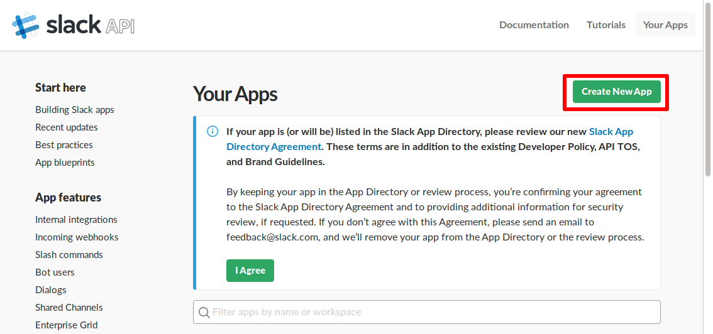
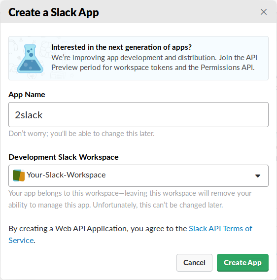
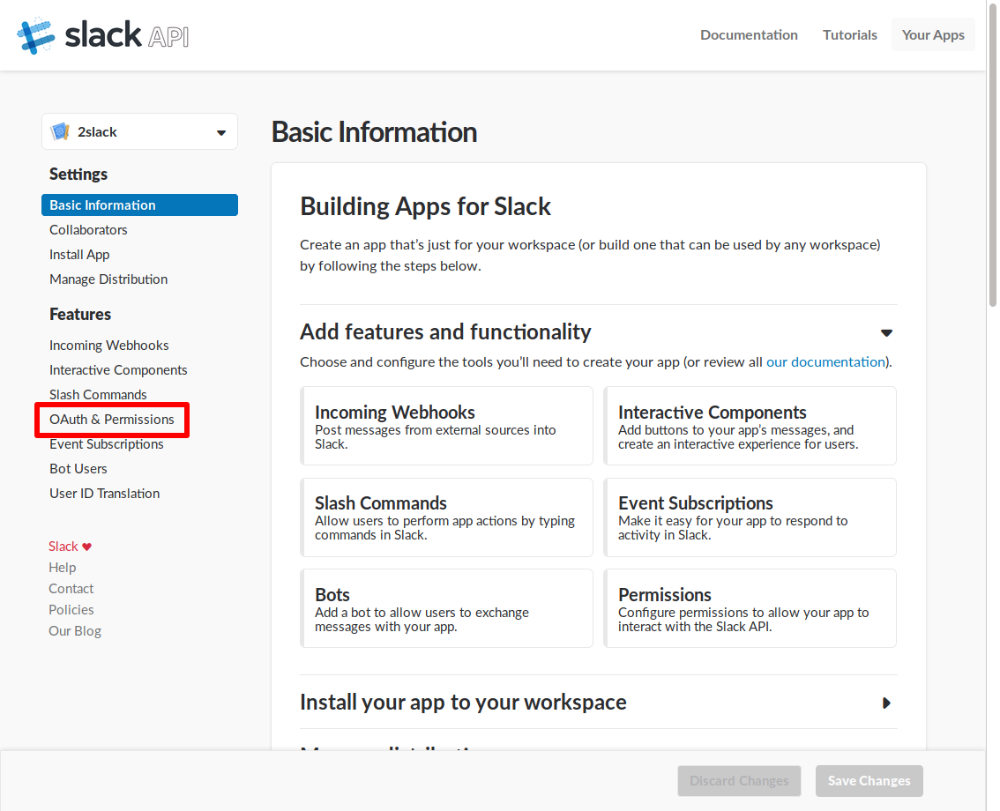
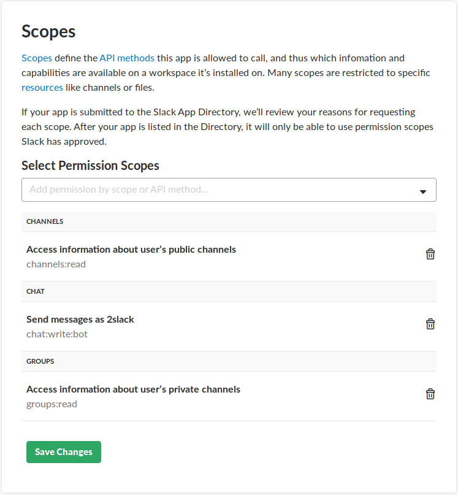
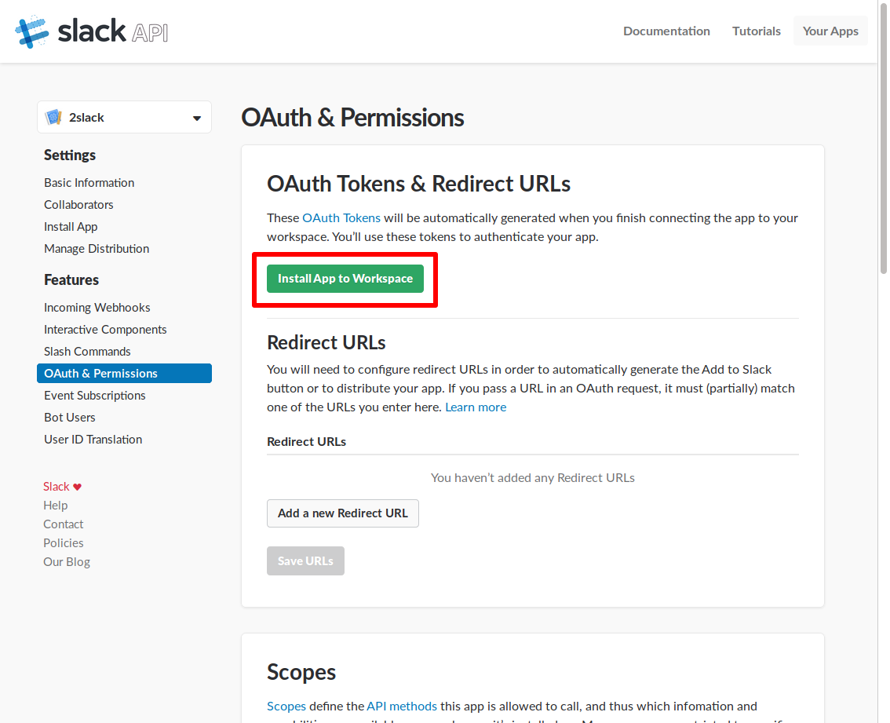
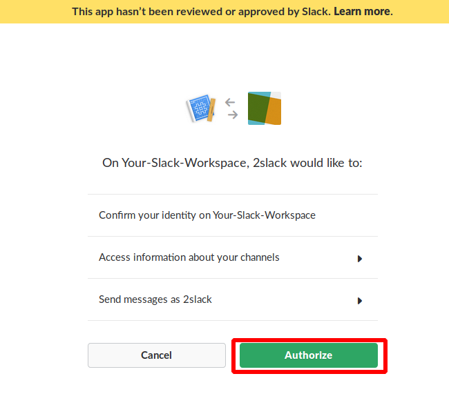
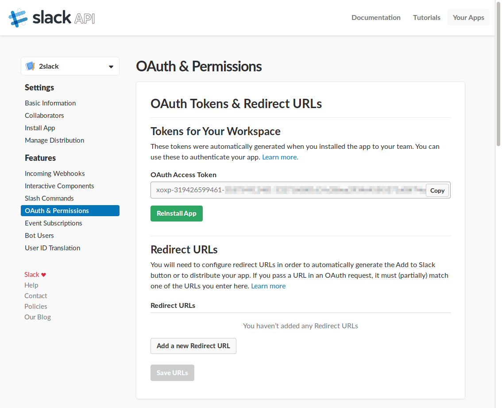

## Slack Installation
 
To use **2slack** you need an Slack Token that has the needed permissions.

### Goto [slack API](https://api.slack.com/apps) and `Create New App`

### Use a good name for the `App Name` (e.g. `2slack`)
### Select your Workspace in `Development Slack Workspace`

### Navigate to your App `OAuth & Permissions` setting

### Scroll to `Scopes` and add the Permissions
- Access information about user’s public channels (`channels:read`)
- Send messages as *App-Name* (`chat:write:bot`)
- Access information about user’s private channels (`groups:read`)

### Install and Authorize the App

### You find the token in the App settings
